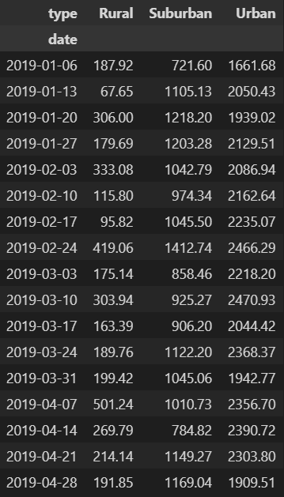
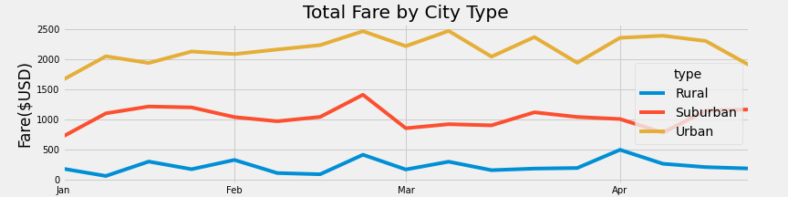

# PyBer Analysis Overview

The purpose of this analysis was to utilize PyBer ride_sharing data to visualize total weekly fares by city type. Ultimately, it will benefit Pyber decision makers to understand how the data differs by city type and how they may be able to make changes to their current process.

# Results

The analysis yielded the following results: 
As seen in the charts below, Rural city types tend to have the lowest total fares. Suburban city types hit in the middle for total fares, and Urban city types had the highest total fares of the three types. 

# Summary

We have identified three business recommendations for the CEO of PyBer. This analysis helps identify possible disparities in city type in order to improve the ride-sharing process. 
 - Business recommendation 1: Since the highest total fares are found in Urban city types, it may be beneficial to add more drivers to Urban areas to increase amount of rides and profits.
 - Business recommendation 2: Rural city types tend to have lower fare totals which could be due to less rides over larger distances. It could be useful to redistribute drivers in order to increase efficiency. 
 - Business recommendation 3: According to the "Total Fare by City Type" chart, there are frequent upticks in rides throughout each month. Refactoring the code could provide PyBer's CEO with more information about which parts of the week or month there is an increase or decrease in rides, in order to better assign riders by city type.