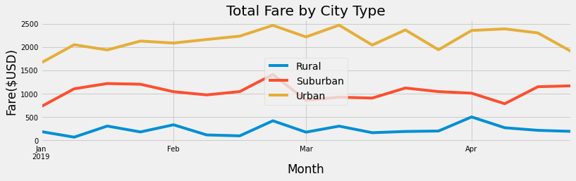

# PyBer Analysis Overview

The purpose of this analysis was to utilize PyBer ride_sharing data to visualize total weekly fares by city type. Ultimately, it will benefit Pyber decision makers to understand how the data differs by city type and how they may be able to make changes to their current process.

# Results

Using images from the summary DataFrame and multiple-line chart, describe the differences in ride-sharing data among the different city types.

# Summary
Based on the results, provide three business recommendations to the CEO for addressing any disparities among the city types.
 - 
 - 
 - 